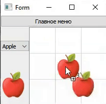

# qtBackpack

Игровой инвентарь/рюкзак. 

## Overview

qtBackpack это мини-программа созданная в рамках тестового задания, имитирующая игровой инвентарь/рюкзак, с использованием фрейворка Qt.
Программа может подключатся и обмениваться данными с простейшей базой данных SQLite.
Реализовано "использование" имеющихся предметов.
Управление предметами сделано по механике Drag-n-Drop. 

## Contents

1. [Description](#Description) \
    1.1. [NewGame](#NewGame) \
    1.2. [Usage-n-Replace](#Usage-n-Replace) \
    1.3. [Continue](#Continue)

## Description 

## NewGame

Для того чтобы начать демонстрацию, необходимо запустить программу и нажать на кнопку  `New Game`.

В случа если раннее был сохранен какой либо инвентарь, он будет очищен и перезаписан новыми данными.

Запустится игровое поле. Слева будут доступны на выбор два предмета (Apple, Water) для размещения в инвентаре. Под переключателем будет показана иконка выбранного предмета. Перетаскивая данную иконку в таблицу справа можно размещать предметы в инвентаре. 

## Usage-n-Replace

Управление предметов сделано по механике `Drag-n-Drop` с подменой местами предметов с случае их наличия в ячейке или объединения в случае их идентичности. Также реализовано "использование" имеющихся предметов, о чем сигнализирует уменьшение счетчика количества и воспроизведение индивидуальных звуковых эффектов и их "удаление" при полном использовании доступного количества.

## Continue

В программе реализованно сохранение данных в файл БД для хранения состояния инвентаря. При первичном запуске программы если нажать на кнопку `Continue` программа попытается загрузить доступное сохранение. В случае если файл с сохранением небыл найден то приложение запуститься в режиме `New Game`.

Во время работы программы в режиме инвентаря можно запустить главное меню. 
Режим инвенторя при этом останется активным. В данном контексте кнопка `New Game` также пересоздаст инвентарь а кнопка `Continue` вернет управление к активному инвентарю.